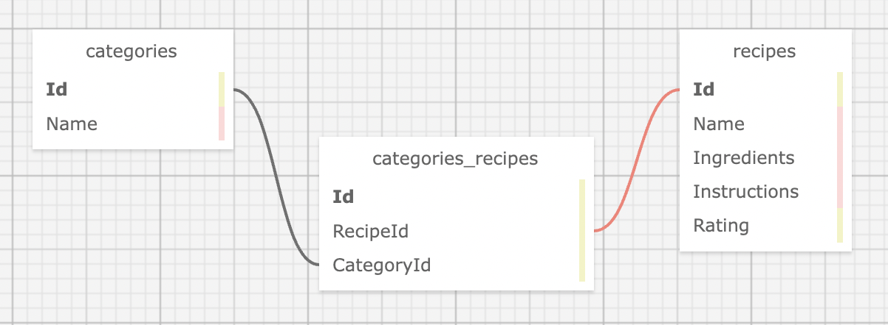

# Recipe Box


#### Contributors: _**Matt Wilkinson & Claire Thorington**_

## Technologies Used

* Markdown
* HTML
* CSS
* C#
* .NET
* ASP.NET Core MVC
* Razor
* MySQL
* MySQL Workbench
* EF Core

## Description & Schema

This app acts as a virtual recipe box. Users can log in, add a recipe, rate the recipe, and see their saved recipes, plus edit and delete entries. They can view recipes by category, sort by a shared ingredient, and sort by recipe rating.



## Setup & Installation Requirements

* Clone repository to desktop
* Create an _appsettings.json_ file in the __RecipeBox__ directory and copy in the following:

```
{
  "ConnectionStrings": {
    "DefaultConnection": "Server=localhost;Port=3306;database=recipe_box;uid=root;pwd=epicodus;"
  }
}
```

* Navigate to the __RecipeBox__ directory in your terminal and enter the following commands, in order:
```console
$ dotnet restore
$ dotnet build
$ dotnet ef migrations add Initial
$ dotnet ef database update
$ dotnet run
```


## Known Bugs

* None


## License

[<a href=LICENSE>MIT</a>]

Copyright (c) _2022_ _Matt Wilkinson &_ _Claire Thorington_


  
Background image by <a href="https://unsplash.com/@calumlewis?utm_source=unsplash&utm_medium=referral&utm_content=creditCopyText">Calum Lewis</a> on <a href="https://unsplash.com/?utm_source=unsplash&utm_medium=referral&utm_content=creditCopyText">Unsplash</a>
  
  
